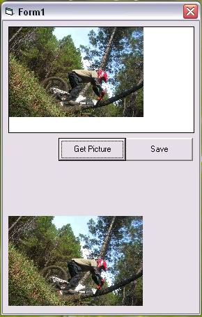



## How to save a picture from image component to JPEG file

### Description

Get picture from image component into picturebox component then you can save as a jpeg file. You can resize picture on image component before save it. Thank to Ed Wilk for the module.
 
### More Info
 

             |
---                |---
**Submitted On**   |2008-01-21 13:41:28
**By**             |[Asep Sutisna](https://github.com/Planet-Source-Code/PSCIndex/blob/master/ByAuthor/asep-sutisna.md)
**Level**          |Beginner
**User Rating**    |5.0 (10 globes from 2 users)
**Compatibility**  |VB 6\.0
**Category**       |[Graphics](https://github.com/Planet-Source-Code/PSCIndex/blob/master/ByCategory/graphics__1-46.md)
**World**          |[Visual Basic](https://github.com/Planet-Source-Code/PSCIndex/blob/master/ByWorld/visual-basic.md)
**Archive File**   |[How\_to\_sav2099501282008\.zip](https://github.com/Planet-Source-Code/asep-sutisna-how-to-save-a-picture-from-image-component-to-jpeg-file__1-69959/archive/master.zip)

